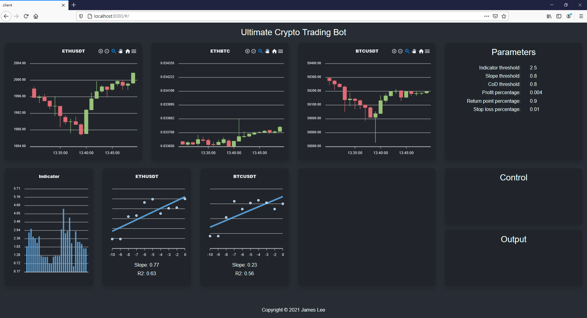

A cryptocurrency analyzing and trading bot. 
Live candlecharts update, indicators analysis. 
More functions to come.

### Data
Binance API
### Backend
Node js 
Express
### Frontend 
Vue 
Bootstrap 
Apexchart
### API
Pusher(live update, backend -> frontend) 
Axios(post requests, frontend->backend)
### Usage
Still under development thus project not utilized for easy installment. 
Install all required node package. 
Locate client and server folder in terminal. 
Execute npm start on both
### Image of app running on localhost
